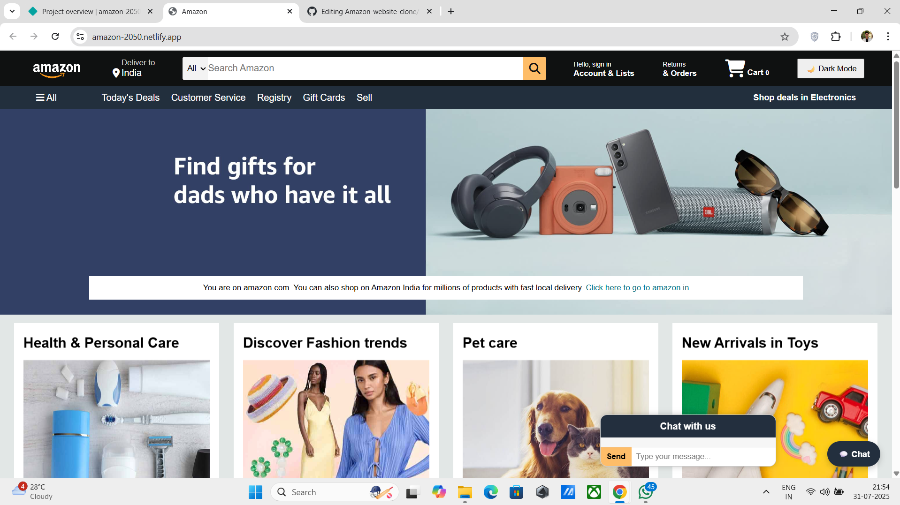

# Amazon-website-clone
# 🛍️ Amazon-Like E-commerce Website

A fully responsive e-commerce website inspired by Amazon, built using **HTML**, **CSS**, and **JavaScript**. This project includes features like product listings, search functionality, a chatbot widget, dark mode toggle, and mobile-friendly layout. Deployed using **GitHub Pages**.

---

## 🔗 Live Demo

🌐 [View Website](https://amazon-2050.netlify.app/)  
*(Replace with your actual GitHub Pages URL)*

---

## 📸 Screenshots

  
*(Add a folder and upload your screenshots if you want to include visuals)*

---

## 💡 Features

- ✅ Responsive design (mobile, tablet, desktop)
- 🛒 Product grid layout with hover effect
- 🔍 Search functionality
- 🌙 Dark mode toggle
- 🤖 Chatbot integration with simulated replies
- 🚀 Smooth scroll and user-friendly interface

---

## 🛠️ Tech Stack

- **HTML5**
- **CSS3**

---

## 📁 Folder Structure

If you have any feedback or questions, feel free to open an issue or contact me at:

📧soumyadipmandal2996@gmail.com
